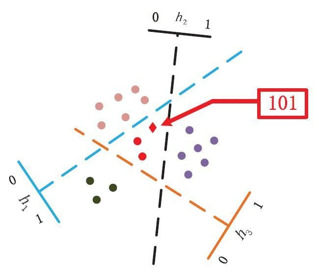

# Causal Matching using Random Hyperplane Tessellations
This repo contains an example implementation of the RHPT 1-Nearest Neighbor matching, described in the CLeaR 2024 paper "Causal Matching using Random Hyperplane Tessellations".
```
@InProceedings{pmlr-v236-dalvi24a,
  title = 	 {Causal Matching using Random Hyperplane Tessellations},
  author =       {Dalvi, Abhishek and Ashtekar, Neil and Honavar, Vasant G},
  booktitle = 	 {Proceedings of the Third Conference on Causal Learning and Reasoning},
  pages = 	 {688--702},
  year = 	 {2024},
  editor = 	 {Locatello, Francesco and Didelez, Vanessa},
  volume = 	 {236},
  series = 	 {Proceedings of Machine Learning Research},
  month = 	 {01--03 Apr},
  publisher =    {PMLR}
}

```

In reponse to the challenges posed by the curse of dimensionality in traditional matching techniques for high-dimensional covariates, we introduce matching using Random Hyperplane Tessellations (RHPT). This method, grounded in the principles of locality-sensitive hashing, offers a simple, fast, and highly effective approach to matching. Below is an example on how RHPT works

<p align="center">
  
</p>


An example of a Random Hyperplane
Tessellation (RHPT) for a set of points in a two-dimensional space ([Link](https://medium.com/@LightOnIO/efficient-neural-networks-training-through-locality-sensitive-hashing-93dc37077a89)). Three hyperplanes -- indicated by dashed lines -- are used to construct a three-dimensional binary hash code for each point. The color of each point represents its binary hash code: red represents 101, black represents 100, etc.


The deep learning methods implemented in this repository are based on the work provided in the tutorial at https://github.com/kochbj/Deep-Learning-for-Causal-Inference. We extend our appreciation for the codebase and guidance provided in this tutorial.

The News dataset can be found at https://www.fredjo.com/files/NEWS_csv.zip and the dataset generation for HCMNIST can be found at https://github.com/anndvision/quince.

# Usage/Executing RHPT and baselines
In the last cell of the notebook, change choice as per the method. 
- 1 for Random matching
- 2 for matching using X
- 3 for macthing using Z=PCA(X)
- 4 for matching using propensity scores calcuated using X
- 5 for matching using propesnity scores calcuated using Z
- 6 for RHPT matching
```
start_time = time.time()
run_exp(choice=6) # Change choice for which baseline do you want
end_time = time.time()
```
